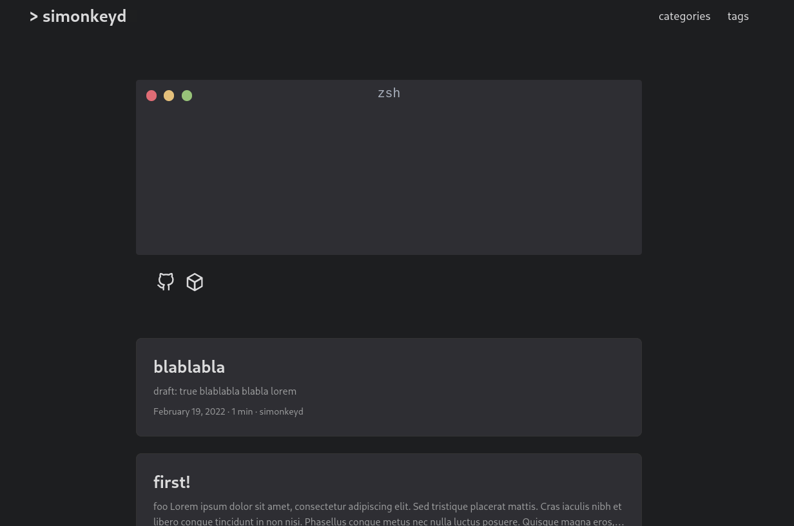

<h1 align=center>Hugo PaperMod | <a href="https://adityatelange.github.io/hugo-PaperMod/" rel="nofollow">Demo</a></h1>

<h4 align=center>☄️ Fast | ☁️ Fluent | 🌙 Smooth | 📱 Responsive</h4>
 

> Hugo PaperMod is a theme based on [hugo-paper](https://github.com/nanxiaobei/hugo-paper).
> The goal of this project is to add more features and customization to the og theme.

The [demo](https://adityatelange.github.io/hugo-PaperMod/) includes a lot of documentation about Installation, Features with a few more stuff. Make sure you visit it, to get an awesome hands-on experience and get to know about the features ...

**ExampleSite** can be found here: [exampleSite](https://github.com/adityatelange/hugo-PaperMod/tree/exampleSite). Demo is built up with [exampleSite](https://github.com/adityatelange/hugo-PaperMod/tree/exampleSite) as source.

---

This fork implements a shell looking info entry based on [termynal.js](https://github.com/ines/termynal) and some small customizations

---

Please refer to [upstream's README](https://github.com/adityatelange/hugo-PaperMod)
